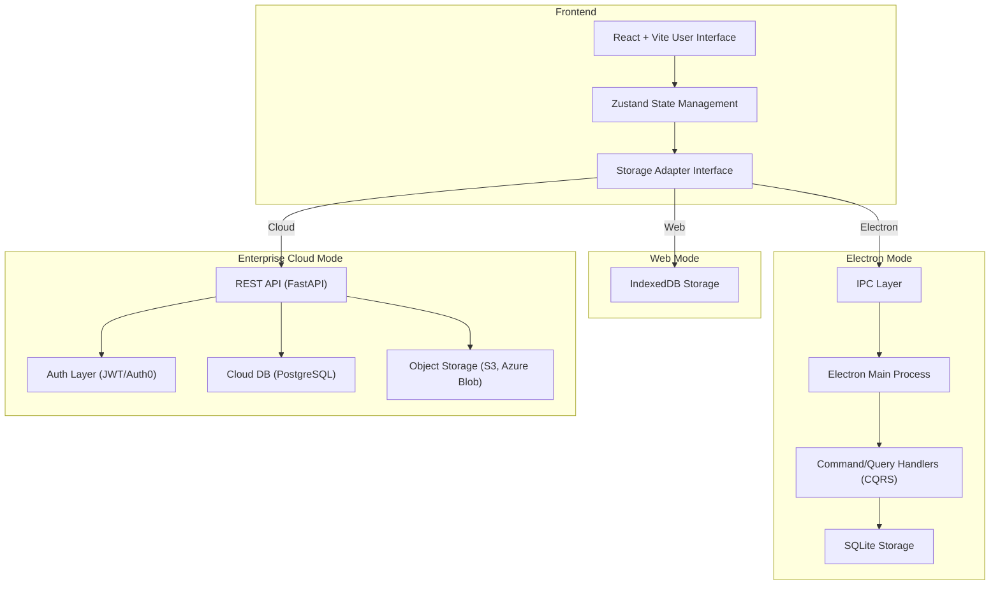

## 1. Overview

**VAI Labeling Studio** is a cross-platform AI data labeling application designed for performance, flexibility, and scalability. The system is built to support local/offline-first workflows, seamlessly transition to desktop applications via Electron, and scale to cloud APIs for enterprise deployments.

This document outlines the architectural design, modular components, platform-specific considerations, and future scalability plans.

---

## 2. Objectives

- ✅ Provide a consistent UX across Web, Desktop (Electron), and Cloud modes
- ✅ Modular architecture with clean separation of concerns
- ✅ Support offline and local-first labeling workflows
- ✅ Enable seamless scaling to a secure multi-tenant cloud backend
- ✅ Maximize code reuse and maintainability across platforms

---

## 3. System Architecture Diagram (Mermaid)



---

## 4. Component Breakdown

### 4.1 Frontend (React + Vite + TypeScript)

- **UI Layer:** Built using React with Tailwind for styling.
- **State Management:** Zustand is used for centralized state management.
- **Storage Adapter Interface:** A unified API (`IStorageAdapter`) abstracts platform-specific storage logic (e.g., IndexedDB, SQLite, or REST).

### 4.2 Web Mode

- **Storage:** Uses `IndexedDB` to provide offline support.
- **Use Case:** Ideal for lightweight browser-based annotation tasks without external dependencies.

### 4.3 Electron Mode

- **Database:** Uses local `SQLite` for persistent, high-performance local data storage.
- **IPC Layer:** Electron’s Inter-Process Communication (IPC) bridges Renderer and Main processes.
- **CQRS Pattern:** Command Query Responsibility Segregation splits operations into:
  - **Command Handlers:** Mutate data (create/update/delete)
  - **Query Handlers:** Read data efficiently

### 4.4 Cloud Mode (Enterprise)

- **API Server:** Built with **FastAPI** to serve RESTful endpoints.
- **Authentication:** Uses JWT or integrations with Auth0 for secure, multi-user access.
- **Database:** PostgreSQL stores structured application data.
- **Object Storage:** S3 (or Azure Blob) used for storing large image/video files and annotation outputs.
- **Security:** HTTPS, rate-limiting, and scoped tokens.

---

## 5. Adapter Strategy

The `StorageAdapter` interface defines methods like:

```ts
export interface IStorageAdapter {
  saveImage(id: string, data: string | Buffer): Promise<void>
  loadImage(id: string): Promise<string | Buffer>
  deleteImage(id: string): Promise<void>
  listImages(): Promise<string[]>
}
```

Each platform implements this interface:

- `IndexedDBAdapter` (Web)
- `ElectronSQLiteAdapter` (Desktop)
- `CloudAPIAdapter` (Enterprise)

---

## 6. Benefits of CQRS in Electron

CQRS allows the main process in Electron to:

- Separate responsibilities for better maintainability
- Optimize queries for performance
- Simplify side effects and command tracking (e.g., undo/redo)
- Future: Integrate Event Sourcing or logging

---

## 7. Deployment Modes

| Mode     | Storage       | Connectivity | Use Case                        |
| -------- | ------------- | ------------ | ------------------------------- |
| Web      | IndexedDB     | Offline      | Browser-based lightweight usage |
| Electron | SQLite        | Offline      | Power users, large projects     |
| Cloud    | PostgreSQL/S3 | Online       | Enterprise multi-user workflows |

---

## 8. Roadmap

- [x] MVP Web & Electron support
- [x] CQRS-based SQLite command/query flow
- [x] Unified Storage Adapter system
- [ ] FastAPI + Auth0 backend deployment
- [ ] Cloud sync capability
- [ ] Multi-user collaboration & conflict resolution
- [ ] Real-time WebSocket updates

---

## 9. Technology Stack

- **Frontend:** React, Vite, TypeScript, Zustand, Tailwind
- **Desktop:** Electron, SQLite, Node.js
- **Backend (Cloud):** FastAPI (Python), PostgreSQL, S3, Auth0
- **Testing:** Vitest, Playwright
- **DevOps:** GitHub Actions, Docker (for backend deployment)
