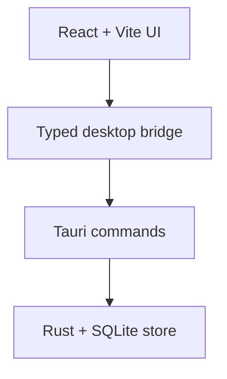

## Overview

Vailabel Studio is a local-first desktop application built with:

- React + Vite for the UI
- Tauri for the desktop shell
- Rust + SQLite for local persistence

## High-Level Design

```mermaid
flowchart TD
  UI["React + Vite UI"]
  Bridge["Typed desktop bridge"]
  Commands["Tauri commands"]
  Store["Rust + SQLite store"]

  UI --> Bridge
  Bridge --> Commands
  Commands --> Store
```

## Modes

- Desktop mode uses Tauri commands and SQLite
- Web docs live separately in `apps/web`

## Goals

- Offline-first project management
- Native desktop capabilities through Tauri
- Shared TypeScript models through `apps/core`
